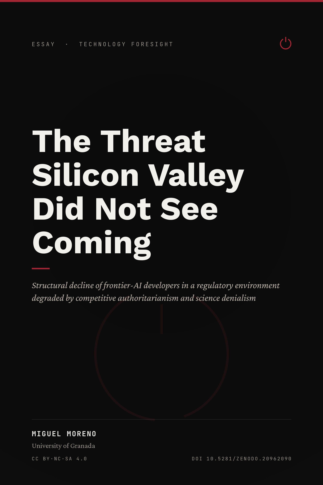

<!-- README.md -->
<h1 align="center">The Threat Silicon Valley Did Not See Coming</h1>

<p align="center"><em>Structural decline of frontier-AI developers in a regulatory environment<br>degraded by competitive authoritarianism and science denialism</em></p>

<p align="center">
  
</p>

<p align="center">
  <a href="https://doi.org/10.5281/zenodo.20962090"></a>
  <a href="https://creativecommons.org/licenses/by-nc-sa/4.0/"></a>
  
</p>

<p align="center">
  <a href="https://switchia.vercel.app/"></a>
  <a href="https://utilizas.github.io/switch/"></a>
  <a href="https://switchia.netlify.app/"></a>
  <a href="https://switchia.pages.dev/"></a>
</p>

---

A short-form essay — argued and referenced to research-paper standard — on how two
complementary forces degrade the governance environment that frontier-AI developers
depend on. Competitive authoritarianism supplies a discretionary instrument (the selective
application of formally legitimate powers); science denialism removes the epistemic
constraint that would limit its use. Their conjunction produces a governance of artificial
intelligence that is at once arbitrary and fact-immune — a failure mode the essay terms
**governance-criteria capture** — taking the June 2026 export-control suspension of a
frontier provider's most capable models as a dated, structurally diagnostic case.

> This work is a short-form essay, argued and referenced to research-paper standard, whose HTML edition adds a range of interactive elements — including a graphical simulation with adjustable parameters — available in that edition alone. 
>
> Published in HTML and PDF under a Creative Commons BY-NC-SA 4.0 licence; the canonical version
> is available at **https://switchia.vercel.app/**.

## Read it

| Edition | Link |
| --- | --- |
| HTML (canonical) | https://switchia.vercel.app/ |
| HTML (mirror) | https://utilizas.github.io/switch/ · https://switchia.netlify.app/ · https://switchia.pages.dev/ |
| PDF | [`silicon-valley-threat.pdf`](silicon-valley-threat.pdf) |
| Archived record (DOI) | https://doi.org/10.5281/zenodo.20962090 |

## Repository contents

| File | Description |
| --- | --- |
| `index.html` | HTML edition (self-contained; embedded fonts and styles). |
| `silicon-valley-threat.pdf` | PDF edition. |
| `scenario-sim.html` | Interactive scenario model embedded in the HTML edition. |
| `scenario-sim-static.pdf` / `.png` | Static fallbacks of the scenario model for print. |
| `cover_silicon_valley.png` | Cover (portrait, 2:3). |
| `refia-social-card.png` | Open Graph social card (1200×630). |
| `favicon.svg`, `favicon-32.png`, `favicon-180.png`, `favicon-512.png` | Favicons / touch icons. |
| `01-guardpress.png` | Figure used in the essay. |

## Citation

> Moreno-Muñoz, M. (2026). *The Threat Silicon Valley Did Not See Coming*. https://doi.org/10.5281/zenodo.20962090

```bibtex
@misc{moreno2026threat,
  author       = {Moreno-Muñoz, Miguel},
  title        = {The Threat Silicon Valley Did Not See Coming},
  year         = {2026},
  publisher    = {Zenodo},
  doi          = {10.5281/zenodo.20962090},
  url          = {https://switchia.vercel.app/}
}
```

## Licence

This work is licensed under a
[Creative Commons Attribution-NonCommercial-ShareAlike 4.0 International Licence (CC BY-NC-SA 4.0)](https://creativecommons.org/licenses/by-nc-sa/4.0/).
